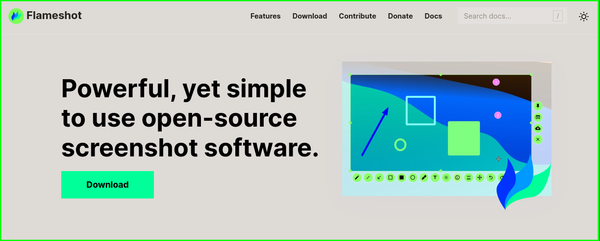

# Screenshot for Report Writing

## Options :
- **GreenShot**
- **Flameshot**

## GreenShot :
Greenshot is better choice if you're on macOS or Windows OS.

## Flameshot :
### I am using **flameshot** here.

### Things I tried with flameshot :

- Added green border for nice look.
- Inverted from dark background to white background. I know I could have change the page from dark mode to light mode but I wanted to try this feature...